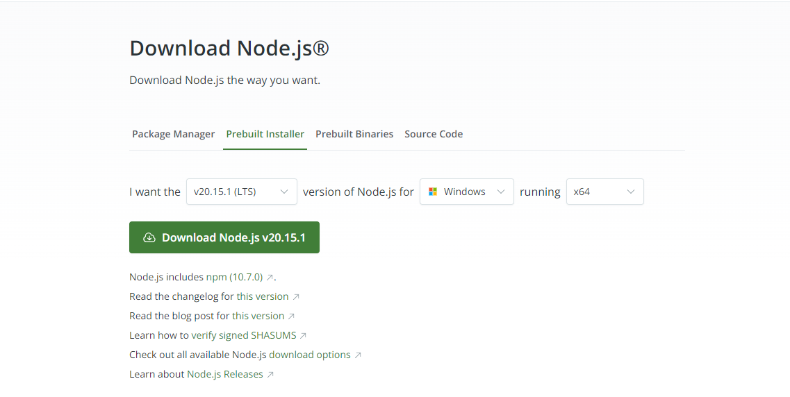
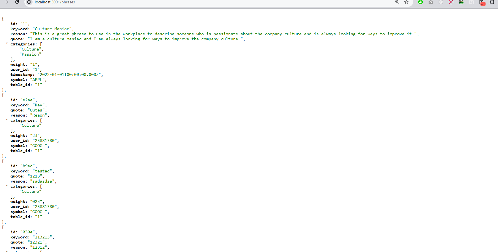

This repository is to create a website where students can learn how financial statements of corporations explain their investments in human capital while participating in games to demonstrate their accounting and finance knowledge and ability to understand and analyze fundamental information on stocks.

CRHCAP Project 2024

Title: Crowd Learning of New Perspectives on Investments Using the Textual Information in Financial Statements 

Tasks: Develop front-end and backend codes to analyze Investments in human capital to improve stock valuation tools using text data from the SEC
       Develop a Learning Game to receive keywords and rankings 
       Develop codes to assign stocks and collect keywords. Test the codes using a sample keyword list. 

# Development Notes

## requirements:

https://nodejs.org/en/download/prebuilt-installer




## To install and run locally:

1. Clone repository

```bash
git clone https://github.com/hpark507/CRHCAP.git
```

2. Run Server Locally

Note the server here, is a mock server with the intention of simulating a real server.

```bash
cd server 
cd mockup -- this is the mock server
npm install -g json-server
npx json-server db.json -p 3001 --watch
```


test

```
http://localhost:3001/phrases
```



3. Run Client Locally

```bash
cd client
npm install
npm run dev
```


## Relevant Links for Development

- [Design Doc](https://snip.mathpix.com/wangnelson2/notes/crowd-learning-of-human-capital---design-document-192e64e2-0745-46d8-a6b9-9a8d6a880c5d)


## Notes

- Stacks: Nextjs Typescript
